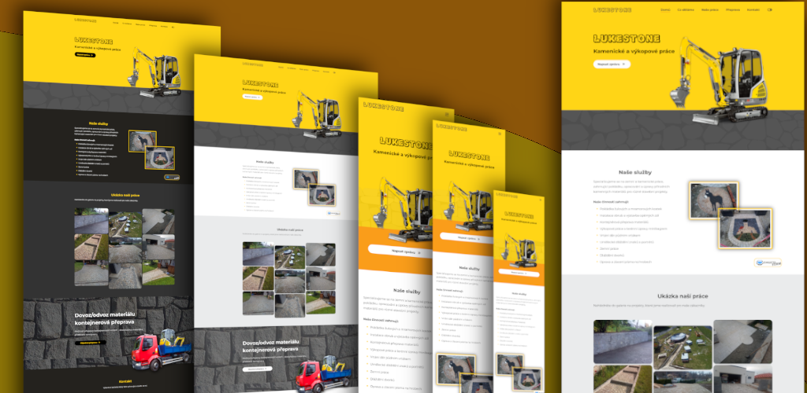

# CZ - Engeto Front-End Academy - Projekt 3 - Komplexní webové stránky

Toto je řešení k **PROJEKTU č. 3** (HTML, CSS, JS) v  [Engeto Academy ](https://engeto.cz/webova-akademie/) od **Engeto.cz**

## Obsah

- ➡️ [Popis](#popis)
- ➡️ [Vlastnosti](#vlastnosti)
- ➡️ [Screenshot](#screenshot)
- ➡️ [LIVE web](#liveweb)
- ➡️ [Media Queries](#media-queries)
- ➡️ [Autor](#autor)

## Popis

Tento projekt má otestovat skutečnou programátorskou práci, kdy člověk musí kombinovat více jazyků dohromady (HTML, CSS, JavaScript). Je zapotřebí si poradit s úpravou kódů, které jsou již k dispozici, a použít je v dané situaci. Ta často vyžaduje úpravu kódů - někdy větší, někdy menší. Práce musí být správně rozvrhnutá - čím se začne a jaké budou další kroky. Do stránek jsou implementovány nové prvky, které v kurzu tvořeny nebyly, ale vše pro jejich vytvoření bylo obeznámeno (např. tlačítko zpět nahoru).

## Zadání

Úkolem je spojit všechny současné znalosti dohromady. Zároveň je zde prostor pro kreativitu. Úkolem je vytvořit **webovou stránku**, která bude splňovat následující požadavky:

1) jednostránkový web ✅

2) web je možné přepínat do dark-modu a zpět do light-modu ✅
3) web obsahuje header, 2 sekce a footer *(* ⛔ *obsahuje více sekcí)*
4) v headeru je responzivní menu minimálně se 3 položkami ✅
5) obsah první sekce je na tobě, ale její součástí budou 3 obrázky vedle sebe, které se po najetí myši budou plynule zvětšovat a po odjetí myši zmenšovat *(* ⛔ *web obsahuje přes 10 takových obrázků, jen v jiných sekcích)*
6) v druhé section bude umístěný formulář ✅
7) ve formuláři se bude 2x zadávat heslo a formulář bude kontrolovat shodu hesel ✅
8) po odscrollování směrem dolů se v pravém dolním rohu objeví ikonka zpět nahoru ✅
9) je na tobě, jestli chceš javascriptový kód zapsat procedurálně nebo objektově ✅
10) web by měl být responzivní ✅
11) snaž se, aby web graficky dobře vypadal (i když hodnocení vzhledu je vždy individuální) ✅

## Tipy
Tady je pro tebe ještě pár tipů:

1) použij kódy, které byly v průběhu kurzu vytvořeny (např. responzivní menu, shodu emailů apod.) - jen je musíš upravit podle potřeby
2) napodceňuj část před psaním kódu - vezmi tužku a papír (word, jakýkoli program) a načrtni si web, rozmysli jaké budou kroky
3) přepínání mezi dark-modem a light-modem můžeš dělat kliknutím na tlačítko, text nebo např. div vytvarovaný do kolečka (stačí mu dát width, height a border-radius 50%) nebo jakkoli jinak,
4) nejdříve vytvoř responzivní web a poté přidej do stránky javascript
5) zvol si téma webu, které tě bude bavit

## Vlastnosti

### Tento projekt obsahuje:
🟢 "Mobile-first" přístup 📲  
🟢 Vlastní vlastnosti CSS 
🟢 Flexbox 
🟢 [Google Fonts](https://fonts.google.com/) - '<i>Montserrat</i>', '<i>Open Sans</i>' 
🟢 Vlastní nahrané fonty '<i>JFRocOut</i>' a '<i>JFRocSol</i>' 
🟢 [Boxicons](https://boxicons.com/) - Open-source systém ikon 
🟢 [ScrollReveal](https://scrollrevealjs.org/) - JS knihovna pro animace po načtení stránky 
🟢 [GSAP](https://github.com/greensock/GSAP) - JS knihovna pro další animace (názvu "Lukestone") 
🟢 [touchTouch](https://github.com/tutorialzine/touchTouch) - jQuery plugin pro zobrazení fotografii pro mobily a PC (prohlížení do strany) 
🟢 Sticky navigační menu (zobrazení/skrytí) - pouze pro mobilní zařízení 📲 
🟢 Samotná stránka obsahuje spoustu fotografii, které zabírají místo - uživatel ale vždy otvírá jen jeden obrázek (vstupní) a tím se proklikne do **albumu** ve kterém prohlíží do stran další fotografie daného alba (dané realizace kamenické zakázky) 
🟢 V patičce stránky jsou linky do těchto **alb**  
🟢 Možnost v sekci **Kontakty** pomocí tlačítek **Messenger** a **Whatsapp** začít psát zprávu přímo na společnost **Lukestone**  

## Screenshot

## LIVEweb

- URL živého webu: ➡️ [www. petrb-engeto-academy-3.netlify.app/](https://petrb-engeto-academy-3.netlify.app/) ⬅️

### Media-queries

- malý mobil: 0-360px
- mobil (výchozí): 361-450px
- tablet: 451-576px, 577-767px
- notebook: 768px-930px
- velká obrazovka: od 1024px

## Autor

- Github - [Petr Bednarski](https://github.com/pettik)
- Frontend Mentor - [@pettik](https://www.frontendmentor.io/profile/pettik)
